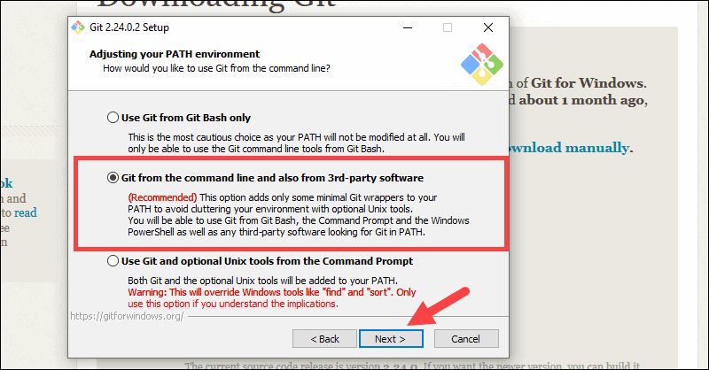
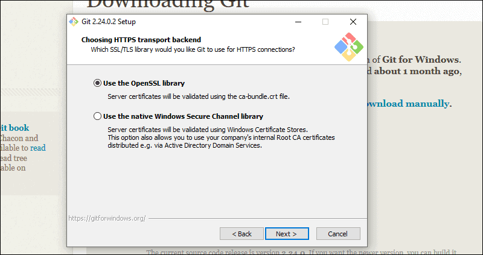
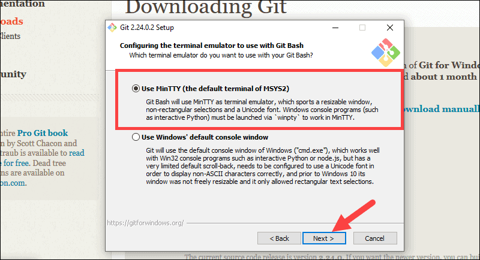

# git install

## 시작해보겠습니다.

> 깃에서 할 수 있는 것은 무엇일까요?
> 1. 파일 시스템 (구글 닥스), 저장고 
> 2. 히스토리 - 작업한 내용을 사진을 찍어 놓듯이 기록하고 검색하고 돌릴 수 있게 해줍니다. 
> 3. 공동작업시 특정한 영역만 대상으로 분업을 하고 하나로 통일된 결과물을 만드는데도 이용됩니다.
> 4. 설치 파일등과 연동해서 C#등을 컴파일하고 설치할 수 있는 환경도 만들어 줍니다.
> 5. 배포 및 CI CMS 젠킨스, 도커등 소스 관리를 위해서도 많이 사용하고 있습니다.

## 필수 사항
1. 관리자 권한 
2. 명령창 (terminal - Powershell, Git Bash, CMD등)
3. IDE 우리는 VS Code
4. 깃허브, 깃 버킷, 깃랩등의 계정 정보

## Git 윈도우용 다운로드 및 설치 
 [공식_사이트](https://git-scm.com/downloads) 에서 선택하거나 다음의 링크에서 다운로드 [윈도우_깃](https://eggs.or.kr/ai/git-setup/-/blob/master/06/Git-2.28.0-64-bit.exe)

 `순서 1`

`순서 2`
> 인스톨러 실행

`순서 3`
> 실행 후 나오는 화면에 Yes를 클릭합니다. - 시스템 변경을 허용 여부

`순서 4`
> 라이센스 동의 여부 "예"를 선택

`순서 5`
> 설치 위치 변경 여부 -- 기본 위치에 "예"

`순서 6`
> 컴포넌트 기본외에 추가 할 경우 - 기본 항목 그데로 "예" 

`순서 7`
> 스트트 메뉴에 바로가기 생성 여부 "예" 

`순서 8`
> 에디터 선택하기 - 이부분은 혹시 깃 명령어중에서 에디터를 사용할 필요가 있을때 어떤 에디터를 사용할 지 여부를 묻는 것입니다. 보통은 사용할 일 없습니다. (저는 빔을 사용해서 .gitconfig파일에서 이를 변경해서 사용하고 있습니다.)

`순서 9`
> Path 환경 설정 -- 이부분도 고급설정을 하시는 분만 변경... 박스부분에 체크후 "다음"

`순서 10`
> OpenSSL (https 리퀘스트등 작업을 하는 경우 , CID PIPE)

`순서 11`
> 라인엔딩 처리방법 선택 -- 유닉스/맥 사용이 익숙하신분은 가운데, 그러지 않다면 기본 첫번째 선택 그데로 "고"

`순서 12`
> 터미널 에뮬레이터 설정 '보통은 MinTTY'

`추가 설정`
 

#### 설치 끝 

## 깃 사용하기 

## 나의 환경 설정하기

` 여기서 부터는 다음의 블로그를 참고 하시기 바랍니다. https://gbsb.tistory.com/10`
